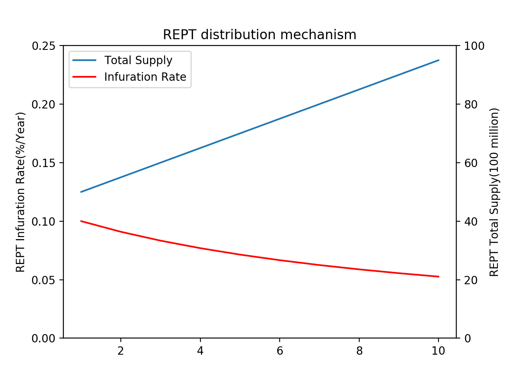

# <a id="top"></a>Nibiru Whitepaper

# <a id="abstract"></a>概要

Nibiru是协助游戏开发，并且更容易的让游戏内的项目和武器、防具、物品等有价值的数据进行公平及安全交易的分布式游戏平台。由于游戏中的条款、武器、防具等将作为在Nibiru链上以独立定义的通证（token）流入市场，因此实现了可以在不受第三方机构影响下进行交易。Nibiru与现有的中心化游戏结构不同，它的所有权不属于该游戏的运营方，因为它在虚拟空间内会创建新的价值。虚拟空间内产生的新价值，将随着技术进步和人类的发展，开始具有现实价值并逐渐产生更大的经济效益。Nibiru中的交易保持平衡，可由用户验证且资金流动可视化，以对抗传统的货币伪造及双重转让等交易行为。现有的货币系统中，具有主从式架构型网络结构，中心化的结算系统，因此容易遭受黑客攻击等外部原因，内部也会因为财务规章制度和繁琐的处理，并出现各种问题。具有P2P网络结构的分布式货币系统可以理解为信息不限于一个点，且不依赖于第三方，因此其是非常安全且负担较少的机制。

# <a id="introduction"></a>引言
## <a id="vision"></a>Our Vision

Nibiru的目标是在游戏的虚拟空间中“建立第二世界”。特别是，作为“玩家的交易平台”，它旨在支持新的游戏开发和创建一个免费的RMT市场。它的目的是让人们在劳动中得到解放，并在游戏中赚钱。最终目标是支持完全身临其境的VR游戏的开发，并旨在虚拟现实世界中创建大型经济。

Nibiru是一个公平安全的分布式平台，支持新游戏开发，可以更轻松地交换游戏中的物品，武器和装甲等有价值的数据。游戏中的物品，武器，装甲等作为不可更改的数字资产存储在区块链上，允许用户在没有第三方干预的情况下自由交易。与传统的中心化游戏结构不同，Nibiru为游戏空间中的数据创造了新的价值，因为游戏内物品的所有权并非由游戏运营商拥有。在个人之间交易日益增加的今天，创造一个多元化的经济区域是理所当然的，在这个区域中，个人所有权在游戏空间中建立起来，预计会得到进一步发展。Nibiru的交易是公平的，用户是可验证的，并且在货币流动中可见，抵制传统欺诈，例如货币伪造和双重转移。

此外，可以通过为验证者建立适当的补偿系统来建立可持续的系统，以维护Nibiru链。


## <a id="principles"></a>Nibiru的基本思想
### <a id="sbp"></a> 游戏玩家如何受益

在传统的客户端-服务器游戏中，通过计费和游戏玩法获得的装备所有权不属于玩家，而属于管理服务器的游戏运营公司。因此，玩家不能按照他自己的意愿购买或出售游戏内物品，并且在游戏之间，移动玩家在游戏期间持有的物品变得毫无价值。事实是，玩家自己已经获得了游戏中的装备，并且玩家需要一种机制来将装备所有权归属于玩家。在Nibiru游戏平台中，玩家将游戏内物品标记作为Nibiru区块链上的电磁信息保存，在与游戏公司分开的空间中为用户拥有的物品标记创建经济区。玩家可以通过REPEX与Nibiru平台上的基础货币REPT交换每个项目通证（token）。通过在离开游戏A时将游戏A中的物品通证（token）与REPT交换，玩家可以使用REPT购买游戏B中的下一个项目，或者过去已被游戏公司规则禁止的RMT通过应用Nibiru平台的机制变得切实可行。在Nibiru上，这可以保留游戏A项目的价值，否则这些项目毫无价值。在不断发展的游戏空间中管理数字资产创造了多样化的经济活动，使玩家能够享受更多自由和有吸引力的下一代分布式虚拟空间。

### <a id="sgdd"></a>游戏开发者如何在Nibiru上轻松开发
许多游戏开发人员都拥有游戏设计和开发技术，但由于他们没有足够的资金，他们无法继续进行开发。此外，对于传统的中心化主要游戏平台，由于它是一种商业模式，从游戏开发者那里收取相当于30％到50％的费用，以保证卓越技术和开发流行游戏的工程师和开发者，但有利可图的结构很难提高。Nibiru已经准备了一个机制，通过Nibiru平台上的ICO，STO，IEO，以及仅转包给传统结构中的主要游戏制造商的中小型游戏公司和附属机构，为游戏开发筹集资金。开发原始游戏后，为开发人员提供在Nibiru平台上以非常便宜和轻松的方式发布游戏的机会。此外，我们将准备一个SDK，以支持传统游戏开发者的所有功能，包括游戏中的项目通证（token）生成功能。

### <a id="pngg"></a>介绍下一代游戏的方式
在当前的游戏产业中，用户不能拥有游戏内数字资产的所有权，而属于他们的中小型游戏公司和开发商则转包给主要游戏制造商。也就是说，这是存在一种偏见的结构，其中一些主要的游戏制造商和中央集权化的现有游戏平台很容易因此获利。此外，那些活跃在电子竞技运动中的职业玩家的数量也在不断增加，但总体来说，沉浸在游戏中只是娱乐，而且往往被视为逃避现实而没有生产力的手段。有部分原因是游戏中花费的时间和金钱不会留给玩家的数字资产。如果在虚拟环境中花费的时间可以在现实世界中被利用，那它将彻底改变人们看待游戏的方式。据预测，未来游戏空间本身将越来越现实。在这里，我们来比较当前游戏的方式和下一代游戏的方式。在下一代游戏中，玩家将更加独立，有权正式声明其物品的所有权，随着电子竞技的扩展，职业玩家将变得更加普遍。属于实际开发游戏的中小型游戏公司的开发者，独立组织项目团队并在不依赖主要游戏制造商的品牌力量的情况下筹集资金，同时拥有现有的技术力量，可用于开发创意游戏。随着科学技术的进步，作为传统的人类工作被机器人和人工智能取代，并且在娱乐多样化日益重要的未来，拥有玩家独立性的游戏将不再发挥作用。负面工作的日子将会结束，游戏将不仅仅是娱乐，甚至会被认为是工作的一部分。分布式游戏平台可以是解决传统游戏行业所面临到的问题的全新方案。下一代分布式虚拟空间，游戏爱好者可以真正活跃，游戏开发者可以自由创建满足玩家需求的新游戏。Nibiru将展示这些新游戏的世界。

# <a id="background"></a>背景
## <a id="egi"></a> 游戏产业发展
近年来，诸如多人在线对战竞技场（MOBA），第一人称射击（FPS）和角色扮演游戏（RPG）等大型多人在线（MMO）等PC游戏的市场规模继续大幅增加。此外，随着智能手机的普及和新技术的创新，手机游戏市场和VR游戏市场也在快速增长。

2015年全球游戏市场为931亿美元，2016年超过1065亿美元，2017年达到1217亿美元，2018年增长至1379亿美元。预计到2019年将达到1519亿美元，到2020年将达到1659亿美元，到2021年增长到1801亿美元。这意味着人类的工作和生活方式，正在发生根本性的变化。随着科学技术的进步，劳动和部分人类工作会被机器人和人工智能所取代。这使人们摆脱了许多传统工作岗位，并开始为更好的生活任务和娱乐工作。互联网的发展促进了在线交流，并在游戏领域创造了多样化的社区。真实的游戏空间通过AR和VR技术实现，游戏越来越接近现实世界。


## <a id="ifcgi"></a> 当前游戏产业存在的问题
在传统的游戏结构下，游戏内物品由游戏运营商拥有，并且用户不能将游戏内物品作为他们自己的资产。在单个游戏中获得的装备数据仅仅是该游戏中的电磁信息，并且不可能在多个游戏之间继承值。分配给游戏的时间和金钱只能在一个游戏空间内使用。此外，大多数运营公司明确禁止在服务条款上购买和销售游戏内物品，并且用户极难将具有超出单个游戏空间价值的数字信息作为资产。最终，用户在游戏空间中的经济行为受到限制。游戏中电磁值的转换称为RMT（RealMoneyTrading），但在许多现有的具有集中结构的游戏中，RMT明显被禁止。然而，现预估该市场的潜在市场规模将达到数万亿日元或更多，并且存在大量需求。同样在游戏开发中，在现有框架中，游戏发布的手段仅限于向中心化公司发布少量费用，以促进开发和创建更具吸引力的下一代虚拟空间需要一种包含电磁值传递和结算执行的游戏空间。Nibiru是虚拟世界中作为第二世界的分散交易，通过在区块链上管理一些游戏内数据（例如用户所有权和游戏内物品项目特征）来分布实现。玩家可以将游戏中的物品保留为数字资产，自由交易并享受利润，而不受中央权威限制或特定条例的约束。如今，世界上将会有一个平台来创建一个专门用于RMT的交换，但是Nibiru不使用传统的中心化结构，而RMT是通过使用下一章描述的区块链技术在分布式网络上执行的。下一代分布式虚拟空间将被创建为“玩家的交易平台”，构建机制并促进每个游戏爱好者的各种经济活动。

## <a id="egt"></a> 区块链技术的出现
比特币是由NakamotoSatoshi在2008年宣布的白皮书“比特币：点对点电子现金系统”[<a href="#ref-1">1</a>]开发的，被认为是货币和法币的创新发明，这是第一个没有中央货币控制机构，而没有政府背景的数字资产的先例。作为比特币的管理模式基础的区块链技术使得采用CPU的计算能力和简单的算法，可以通过分布式网络管理分类账。以太坊[<a href="#ref-2">2</a>]是由以太坊基金会推动的开源项目，是具有图灵完整扩展语言的下一代智能合约分布式应用平台。以比特币和以太坊为代表的主要加密货币都是基于区块链技术。电磁信息的加密，Timestamp，一致性算法和经济激励结构，允许每个节点处理P2P交易并管理分布式账本，而不必相互信任，从而解决因为中心化权限的存在，导致出现的电磁信息存储的高成本，低效率和安全问题。区块链本身并不是一项全新的技术，但可以说它是一种将P2P通信，加密技术和数据结构等技术结合在一起的创新。

# <a id="problems"></a>課題
##<a id="ifbi"></a> 区块链行业面临的挑战
分布式自治系统的发展吸引了更多人，区块链项目在全球范围内不断增加，许多应用项目正在被进行开发。随着各种使用案例的出现，从简单的电子货币到包含智能合约的无基于应用的程序，以及基于Ripple构建全球规模的结算系统层，区块链发展本身有许多需求和挑战，并且无时无刻的发生。与许多软件不同，不需要用户或客户端更新的分布式区块链可以利用协议更新来创建“硬叉”或“软叉”，系统受到很大限制，从而导致社区的许多损失。关于比特币社区中区块扩展的争议，会阻碍比特币协议的发展。比特币的区块链的容量有限，导致超过一百万笔交易的保留，迫使用户支付额外的昂贵交易燃料费用。在以太坊中，处理DAO问题的困难。导致了社区的分裂和用户体验的恶化。随着加密货币的投机热量在全球范围内增加，需要使用0阻碍、高流畅项目，并且需要能够解决上述问题，基本上不需要区块链进行炒作，在未来实现分布式社会得以实现。

## <a id="pcca"></a>当前共识算法存在的问题
目前广泛使用的一致性算法不是足以实现上述设计目标的算法。PoW共识算法是一种零和游戏，它基于较小的计算能力执行审批任务。具体而言，批准权的给予首先解决需要大量计算的哈希计算的节点。随着当前交易量的增加，Difficulty需要超级计算机和大型服务器等，并且存在诸如大功耗和51％攻击的各种问题。另外，因经济规模的大小，大量的小规模矿工可以处于相对有利的地位。规模经济指的是，花费100亿日元的小成本的小成本能得到1亿日元的小成本的100倍以上的收益。这是因为大规模生产可以降低成本，并且由于网络的地理因素可以有利地执行挖矿。另外，由于PoW是通过不特定多数人进行批准作业，所以批准作业必然是需要时间的，而不能立即在游戏内进行结算。PoS具有根据coin age和持有量被授予批准权的机制，并且不会发生PoW电力的大量消耗的问题。然而，具有巨大的初始资本的人可以优先产生区块，导致一些持有者的寡头垄断，并且可能减少货币本身的流通量。此外，PoS可以相对容易地生成区块，从而导致无任何风险的生成错误区块的问题。

## <a id="ietps"></a>以太坊的问题与TPS的必要性
以太坊将通过图灵完整的扩展语言与比特币使用的区块链嵌入，实现了下一代智能合约。实际上已经开发了许多基于以太坊的分布式应用程序。与通过UTXO（UnspentTransactionOutput）表示货币的比特币不同，以太坊通过在区块链中存储状态转换来存储数据，但其“状态”是称为“账户”的对象[<a href="#appendix-a">付録 A</a>]代表。账户分为由私钥管理的EOA（外部所有账户）和由自己的合同代码管理的合同账户。使用状态转移函数将两种类型的账户的数据存储在区块链上，并且可以仅满足于实行某些条件时的智能合约。

以太坊是一个创新平台，可以构建一个协议，可以将任何分布式应用程序实现为最终的抽象基础层，但是更多人加入以太坊网络也意味着面临更多的挑战。由于以太坊网络是一个允许实现所有分布式应用程序的平台，所以除了游戏之外的所有项目都在以太坊网络上同时开发。因此，以太坊网络需要处理大量交易，并且在交易增加和交易费用上涨的情况下，2018年发生了多达30，000起未经证实的交易。专注于TPS（每秒交易次数），虽然与比特币相比有所改善，但Ethereal的数据显然在未来预计会增加的网络中缺少7到8次，并且还能立即解决在游戏行业中，在需要的地方，它会大大减少用户体验。虽然讨论了使用脱链技术等进行改进的建议，但实施的时机和可行性尚不清楚。此外，应该注意的是，该系统已经开始回滚以应对DAO问题，并且由于硬分叉而导致社区分裂。以太坊的使用涉及多个问题和各种项目干预的风险，其中Nibiru为实现目标的自由虚拟空间需要一个专门用于游戏的用户体验高的新框架。


## <a id="psc"></a>智能合约要解决的问题

说到以太坊的区块链游戏，2017年12月在以太坊上发布的养猫游戏——CryptoKitties，带给了大家一个全新的体验。由ERC721代表的Kitties的所有者是持有的通证（token）的人。因此，用户还可以在市场上出售Kitties或直接将它们发送给朋友。这种“将数字资产的所有权分配给用户”将是传统游戏与使用区块链的下一代游戏之间的主要区别[<a href="#appendix-b">付録 B</a>]。虽然CryptoKitties显示出与传统游戏的差异，但它也突出了区块链游戏的潜在优势。当CryptoKitties流行时，以太坊上的交易堵塞导致交易燃料价格上涨。此外，目前，openZeppelin提供的ERC721标准已经设定，但当时的规范并未修复，因此Kitties合同没有在转移事件中给出的索引。因此，有必要在另一个数据库中管理通证（token），因为它不能在区块链上执行以搜索包含特定地址的任务。由于已经部署了Kitties合同，因此无法直接修改这个合约。

从上面可以看出，在以太坊上想要实现游戏项目时存在以下一些问题。

-	由于与其他项目的竞争导致性能下降

智能合约通常以特定的编程语言开发，可由底层虚拟机解释。这些编程语言通常是不成熟的，并且固然的受到虚拟机约束的限制。例如，在以太坊虚拟机中，开发人员无法实现自动代码执行。开发人员也仅限于EVM基于账户的系统，他们只能从一组有限的功能中进行加密操作。这虽然只是一个例子，但却说明了通证与智能合约所相关的环境实质上缺乏灵活性。

-	由于与其他项目的竞争导致性能下降

所有智能合约均由同一虚拟机执行。这意味着他们争夺资源。此外，即使状态机被分成多个子集（例如，通过分片），智能合约也需要由虚拟机进行互操作，这导致比在状态机级别实现的本机应用程序更好的性能，但它的性能是有限的。

-	因为无法更新，所以可扩展性低

智能合约共享基础环境这一事实的另一个问题是由此产生的主权限制。分布式应用程序是涉及多个玩家的生态系统。如果应用程序构建在通用虚拟机区块链上，则这些参与者的主权非常有限，最终将被底层区块链的管理所取代。即使应用程序中存在错误，也无法做到这一点。

此外，代表Kitty的ERC721代币被定位为金融产品，预计将来会被更高价格的人购买，而非游戏物品。由于这并非天生就是在游戏中产生价值的游戏物品在P2P中交易，因此很难将游戏中的内在乐趣带出来。基于游戏乐趣的项目（换句话说，在有趣的游戏中值得使用的项目）正是虚拟世界中有价值的东西。

此外，尽管有许多数字资产利用了ERC721的这种不可替代性，但是通过在区块链上交易不仅仅是角色，而是游戏中的物品，区块链游戏才最有价值。为了做到这一点，需要一种协议，允许自由交换由虚假代币表示的游戏内物品和由非虚拟代币代表的游戏角色。

# <a id="solutions"></a>解决方案
## <a id="nh"></a> NibiruHub专注于游戏开发
通过使用区块链形成成为游戏中心的集线器，可以沿着每个游戏，实现高度可扩展的区块链，并且还可以在Nibiru网络上交换每个游戏的项目标记，预期未来可以有机增长。


## <a id="agob"></a> 区块链专业游戏的优势
Nibiru旨在使用Tendermint构建一个特定于游戏的区块链[<a href="#ref-3">3</a>]。人们认为使用原始链条可以享受以下优点。

- 灵活性

由于tendermint可以自由地实现符合ABCI标准的接口，因此可以在区块链上独立的实现状态机。此外，应用程序可以自由设置验证器的数量，设置气体，并选择通证（token）模型。

- 表现

与PoW相比，PoS可以实现压倒性的TPS。与以太坊不同，其中一个巨大的优点是不需要与其他项目竞争资源。

-	安全

不必担心虚拟机中出现的错误，因此可以专注于应用程序开发。

-	维护

由于涉及各种利益相关者，以太坊不允许我们轻松修复错误，但我们自己的基于tendermint链允许我们通过社区内的治理来处理共识下的错误。另外，当改变游戏物品的规格等时，可以容易地升级。


## <a id="rept"></a> REPT通证模型
Nibiru网络是一个多资产分布式分类账，但其中一个特殊的本机通证称为NibiruGovenanceToken（NGT）。NGT是NibiruHub唯一的抵押通证。NGT表示所有者有权投票，验证或委托验证人。此外，在NbiruHub上分发的通证包括REPT。这与以太坊的ETH一样，可用于支付交易费用以减少垃圾邮件。额外的NGT和区块奖励作为REPT提供给委托给验证者的验证者和委托者。

### <a id="dis"></a> REPT分配机制
每次生成新区块时，验证器和委托者可以根据NGT的抵押金额获得PERT作为区块奖励。REPT的上限为100亿通证，当最初的REPT分配金额为50亿时，调整为每年500亿REPT为Block薪酬。因此，未来10年的通胀率将在10％至5％之间。达到限额时，没有验证区块奖励，只有交易费用成为验证者和委托人奖励。




###<a id="vm"></a> 验证器管理

NibiruHub基于Tendermint的软件，该软件依赖于负责提交新区块的验证器。验证器通过执行包含用每个私钥签名的加密签名的完整节点和广播投票来参与一致性算法。网络中的任何人都可以通过声明它是验证者的候选人，根据他们自己的NGT（任何数量）和委派的NGT中的抵押数量，成为验证者的候选者达到确定上限的节点可以是NibiruHub的验证器。验证器和委托者可以在区块生成时接收REPT，并且可以在Tendermint执行时通过通证（token）接收交易费。开始，交易费也以REPT支付。验证者可以为委托人设定任何费用。

此外，NibiruHub上的验证员和代理人可以对参数的更改进行投票，例如区块Gas limit，升级调整以及NibiruHub机制的修订。验证者在治理系统中发挥特殊作用，系统的验证者需要为所有提案投票。此外，未投票的委托人部分将移交给验证人。如果发现验证者的双重签名，重复离线状态，不参与操作等，则抵押的NGT（包括委托的NGT）将根据其重要性被削减。


## <a id="consensus"></a> 验证器数量的限制

### <a id="bft"></a> BFT系统
BFT[<a href="#ref-4">4</a>]解决了最终的不确定性和性能问题，这是PoW和PoS的缺点。与PoW和PoS不同，区块链分支不会发生，因为区块是在通过验证器做出决定之后生成的因此，由于已确定的块不会被覆盖，所以在确保完整性的同时，不需要像PoW那样在满足条件之前持续计算，所以在性能上也是非常高速的结构。
对于具有n个节点的共识系统，分布式容错表示f=（n-1）/3的容错。通过确保没有达成共识的节点超过“（n-1）/3”，可以保证系统的功能和稳定性。区块链的总分类账由验证程序节点维护，而正常节点不参与共识以简化整体共识构建过程。这种公差能力确保了安全性和可用性，适用于所有环境。区块链是一种分布式分类账系统，参与者通过P2P网络相互连接，并且广播其中的所有消息。该节点具有普通节点和验证器节点两个作用，并且正常节点使用该系统进行传输和交换，并接收分类账数据。另一方面，验证器节点为整个网络提供计费服务并维护分类账。信息传输的完整性和真实性是加密保证的，而发送者需要将签名附加到传输消息的哈希值。


### <a id="tendermint"></a> Tendermint BFT 算法
Nibiru打算使用基于BFT的PoStendermint作为共识引擎，解决上述现有共识算法的问题，并具有强大的容错性和最终的确保性。Tendermint是用于在多台计算机上安全且一致地复制应用程序的软件。安全意味着即使多达1/3的机器不以任何方式运行，Tendermint也能正常工作，而始终所有非故障机器都会查看相同的交易日志计算相同的状态。安全且一致的复制是分布式系统中的一个基本问题。这在广泛应用的容错性中起着重要作用，从货币到选举，基础设施协调等等。Tendermint由两个主要技术组件组成：区块链共识引擎和通用应用程序接口。一个名为TendermintCore的共识引擎是在所有机器上以相同顺序记录相同交易的地方。称为应用程序区块链接口（ABCI）的应用程序接口允许以任何编程语言处理交易。开发人员可以使用Tendermint进行BFT状态机复制，以任何编程语言编写应用程序。Tendermint旨在易于使用，易于理解，高性能，并且适用于各种分布式应用程序。通过使用Tendermint，有以下优点。
-	每秒处理数千笔交易
-	可以在生成块后立即获得最终结果（已批准一次的交易不会被撤销，因为这是具有BFT特征的投票类型共识）
-	围绕任何编程语言的区块链协议进行开发
-	可通过共有链和私人链实施
-	只要三分之一或更多的网络参与者不是恶意的
接下来介绍使用tendermint实现的应用程序的交易处理和共识构建。


-	由应用侧方用户生成交易，并且从应用的client向daymon写入数据。
-	daemon接受了客户的要求，并向MempoolCache进行交易。
-	使用CheckTx，在应用逻辑侧进行交易的验证(mempool连接)。
-	在进行pass的情况下，交易移动到mempool，未通过验证的交易被驳回。
-	validator(proposer)提议的validator基于tendermint的三相柯密算法，在其他validator之间达成共识
-	validator是使用abi-cli、BeginBlock，DeliverTx……将EndBlock，Ciommit送到应用逻辑方面(consensus连接)
-	应用逻辑方面，进行交易的状态更新/validatorset的更新，并且将其信息返回到tendermint侧
-	每个Validator都将新方块保存在自己的DB中。

值得注意是，tendermint已经确定了区块的格式，并且其应用程序必须通过实现ABCI来生成适合其格式的交易。这样，无论创建什么交易，区块都将按照在tendermint上指定的方式生成，并且在共识层中，应用程序将可以从不必实现任何内容中受益。


## <a id="nf"></a> Nibiru功能
### <a id="wa"></a> 钱包和账户
目前，在进行加密货币交易时，用户准备并使用专用钱包，但如果在游戏平台上存在大量繁琐工作并使用现有服务，则玩家的用户体验将显着降低。然而，Nibiru上的钱包允许玩家通过与游戏中使用的ID链接来轻松快速地进行交易。Nibiru钱包支持在Nibiru平台上发布的所有通证（token），并且可以安全地存储每个游戏中的REPT和项目通证（token）。此外，与普通钱包服务，其他的第三方地址，可以发送REPT和物品通证（token）与Nibiru的钱包，有可能项目通证（token），用户可以访问Nibiru的DEX之间的交易。

要在Nibiru平台上玩游戏，用户首先要创建一个Nibiru钱包。创建钱包时，会为每个用户分配一个NibiruID。用户可以通过输入在钱包创建时输入的NibiruID和密码并登录钱包，同时设置REPT和项目通证（token）的余额管理以及注册游戏的账户设置。钱包和游戏账户通过NibiruID链接，并且当登录到钱包时，用户同时登录到游戏账户，并且可以一键切换到游戏屏幕。通过将游戏账户与钱包功能集成并将其与NibiruID相关联，用户不必像以前一样单独管理游戏账户和钱包（游戏账户和钱包同时登录并且可以省略在项目购买时登录钱包），并且可以增强用户体验。对于现有游戏，通过将SDK与项目通证（token）生成功能相结合，游戏公司方将能够使Nibiru链上可管理的物品发布在游戏中，并且游戏的多样性将被扩展。那时，没有在Nibiru钱包中注册的传统用户只能通过创建新的Nibiru钱包来参与买卖物品。此外，通过向Nibiru钱包添加聊天，朋友和群组功能，可以主动执行跨越游戏边界的玩家之间的通信。


### <a id="it"></a> 物品通证（token）
物理通证（token）的生成是最具有代表下一代分布式游戏平台的功能，其中玩家对游戏内项目持有作为数字资产的所有权并以自由活跃的方式进行交易。现有运营方面的服务器被保留了游戏内道具,使用区块链技术,它作为数字资产所有权根据用户管理、转让、买卖,被作为虚拟空间的第二世界,创造巨大的经济地区。
物品标记有两种类型。有价证券和非资金代币。前者对应于以太坊上的ERC-20通证（token），用于游戏中的许多药水等物品。成为Fundible通证（token）的游戏物品可以逐个替换，例如，Alice拥有的一个通证（token）和Bob拥有的一个通证（token）是相同的。然而，许多游戏都有独特的游戏内物品和个人价值，使游戏空间更加精彩。具有独特等级，攻击性，技能等的游戏内物品将其状态保持为元数据并成为不可资助的通证（token）。这对应于以太坊上的ERC-721通证（token），并且是世界上唯一的不可替代通证（token）。此时，Alice持有的一个通证（token）和Bob持有的一个通证（token）可能无法等效交换。对于任何项目通证（token），用户可以在Nibiru上作为数字资产拥有，并且可以使用NibiruDEX等轻松进行交易。此外，Nibiru还准备了一种机制，允许游戏开发人员轻松地将这两个通证（token）作为SDK发布。


### <a id="dex"></a> Nibiru Dex和拍卖
现在大多数虚拟货币的交易都是通过运营主体所在的交易所进行的在交易所的决策中，为了使用中心化的方法，用户将资产从钱包发送到交易所钱包，交易所的数据库管理用户的资产余额。而资产本身由交易所存储。因此，用户必须信任(trust)所述交易所，并且用户的数字资产完全依赖于第三方(交易所)。在中心化交易所中，除了交易所不带走用户资产或黑客行为导致客户资产丢失之外，还存在单点故障。因此，访问集中，DDoS攻击等可能导致交易所服务器故障而不是区块链发生故障，从而无法进行交易。另一方面，没有经营实体，用智能合约执行的交易被称为分布式交易。用户始终通过将钱包从钱包发送和存入合同地址来管理和交换资产，使他们能够在不信任第三方的情况下进行交易（交换压力）。但是，与集中交换相比，很难说它已经投入实际使用，因为它用户较少，缺乏流动性[附录C]。基于当前的情况，在Nibiru上，为了实现物品代币的分布式市场而不涉及第三方，我们将构建一个Nibiru DEX并准备一个玩家可以自由交易物品代币的环境。在NibiruDEX中，你可以使用REPT作为主要货币在Nibiru平台上交换任何项目通证（token）。因此，Alice可以出售游戏A的项目通证（token），购买游戏B的项目通证（token），然后逐项列出它，游戏B可以使用该项目。确定项目代币和REPT的交换比率是基于市场原则，市场价格以供需匹配的价格平衡。稀有度较高的项目价格较高，随着玩家在虚拟空间中的经济活动变得活跃，虚拟经济区域通过在Nibiru DEX购买和销售物品代币构建。至于Nibiru DEX，也缺乏流动性和缺乏实用性，因此正在进行的项目，采用自动确定代币价格和流动性的机制，可以立即解决Bancorprotcol[<a href="#ref-5">5</a>]它也正在考虑引进该技术。此外，对于稀有物品代币，例如几种罕见的代币，在物品代币中，DEX没有足够的买卖板块，因此引入了称为NibiruAuction的机制来提供时间限制。通过竞标拍卖，为了符合预定的拍卖格式，想要出售物品代币的玩家可以简单地通过设定投标截止日期将物品出售给具有高出价金额的玩家（单一价格密封投标模型）。

### <a id="et"></a> 玩家之间的公平交易
如果你想直接与通过游戏社区亲近的第三方进行交易，可以使用Nibiru上安装的托管交易来防止欺诈性交易。让我们来举一个简单易懂的例子。我们同意Alice和Bob希望通过游戏中的聊天功能等成为朋友，并希望将Alice拥有的游戏A中的项目与Bob拥有的游戏B中的项目进行交换。可以简单地将项目通证从Alice发送给Bob，但如果Bob有恶意，Alice会在游戏A中发送一个项目，但Bob不会在游戏B中发送项目。存在欺诈损害的可能性，例如在Nibiru上，通过使用已经唯一实现的模块可以进行托管交易，并且Alice和Bob各自将一个项目通证发送到托管专用地址，并且两个项目通证都已存入。此时，自动执行模块中定义的项目通证转移的转移功能，并将游戏B的项目发送给Alice，并将游戏A的项目通证发送给Bob。此外，如果Bob在确定的时间内没有将游戏B的项目通证发送到托管地址，则确定Alice将按原样返回游戏A的项目令牌，从而防止其中一个人发生欺诈行为。

### <a id="funding"></a> Nibiru Funding
目前，许多MMORPG和社交游戏开发都是由主要游戏制造商分包的中小型游戏公司执行的，但个人可以轻松构建应用程序，包括移动游戏。可以说，除非像过去一样属于主要游戏制造商，否则无法制作游戏的情况，正在发生变化。在Nibiru，一种机制允许任何人（包括个人游戏开发商和资金有限的中小型游戏公司）自由进行funding，目的是招募团队并为游戏项目筹集资金。进行ICO和STO，IEO等funding的游戏开发者将提交白皮书和计划，向社区清楚地展示新游戏的想法和投资者的利益。用户根据自己在社区中仔细审查和讨论的判断来决定是否投资该项目。投资者将REPT转移到由funding游戏开发者准备的合同地址并接收本机通证（token）。本机通证（token）持有者有权在游戏启动时首先获得稀有物品，或执行funding，以便REPT可以根据智能合约自动接收X％的游戏销售额。你可以从该方最初提出的各种好处中受益。通过这种funding机制，投资者可以支持新游戏，开发商可以筹集资金并顺利进行开发。新游戏可以形成新游戏出现在Nibiru上的循环，新游戏的增加导致新用户的获得并有助于Nibiru平台的增长。

如果你像以前一样设置游戏基金，那么投资者可以获得股息后，只有百分之几的利润。游戏公司有动力增加支出作为回报，以尽可能减少对投资者的红利。此外，几个月来实际获得投资者分红的情况并不少，这对投资者投资游戏行业构成了障碍。

通过使用Nibiru funding，游戏开发者可以有效地筹集资金，组织自己的项目团队并开展游戏开发。由于使用区块链的无信任系统，投资者还可以积极地将游戏项目视为投资目标，而不必担心开发商的欺诈等。此时，由于Nibiru funding发布的本机通证（token）被视为安全通证（token），并且存在与每个国家/地区的法律冲突的风险，因此游戏开发者必须遵守每个地区的法律，例如，持有许可证。有必要与传统的基金组织合作制定funding等措施。


### <a id="sdk"></a> Nibiru SDK
为了让所有游戏开发者加入Nibiru社区并创建分布式游戏平台，我们将提供一个SDK，允许传统开发人员轻松加入。例如，Unity和虚幻引擎是目前用于许多游戏制作的软件。通过准备用于标记使用这些软件创建的游戏物品的SDK，从事传统游戏创建的开发人员可以轻松地与Nibiru连接。在现有平台上安装支付系统时，需要支付30％到70％或更多的费用作为手续费，但使用NibiruSDK无需支付费用。


# <a id="conclusion"></a> 结论
区块链是一种技术，可以在没有集中的第三方的情况下批准P2P（PeertoPeer）交易，并且围绕着比特币开发，具有防篡改和高可用性。作为一项能够显着降低运营成本的新技术，已引起各方面的关注。除汇款和付款外，国际汇款和物联网应用也正在尝试中，目前正在各个领域进行实证研究。但是，目前的情况远未在任何情况下实际使用，并且仍在开发中。2017年推出了各种区块链项目，ICO的资金充足。但是，也存在欺诈性项目，在某些情况下，不需要使用区块链，而是强迫ICO通过将区块链与区块链联系起来筹集大量资金。尽管区块链的内在价值是“无信任”和“无权利”，但忽视它的项目与现有机制没有什么不同，不能说会带来一场革命。可以毫不夸张地说，在真正了解区块链的含义之后，有一个支持项目的社区，通证（token）的实用价值以及产品本身才能够保留区块链项目的财富。社区基本上是从底层到顶层的生态系统，坚信它们是开源的，非盈利的，并且它们与现有的自上而下的商业生态系统完全不同。通证（token）代表价值的所有权，是一种电子数据，但在创建虚拟世界的新经济区方面起着重要作用。产品是使用区块链的技术产品本身。如果没有社区存在或代币值，即使只有进行的产品，也不能说它足以吸引区块链项目的吸引力。在区块链缺少可用性的情况下，决定着无数个区块链项目的未来，是建立在一个确定了可用性方案的项目的存在之上。
作为区块链项目的一个方面，Nibiru是一个基于实用价值的区块链，以确立其作为游戏用例的地位，而区块链技术正在全球范围内投入实际使用。并构建一个附带的扩展应用程序为实现这一目标，Nibiru将专注于实施游戏内物品标记以建立游戏用户的物品所有权以为提供便利用户之间的交易，以及NibiruDEX为游戏用户提供交易的方便性、为游戏开发商所提供的Nibiru内的FFunding系统和SDK系统的开发。除了运行基于社区的操作并将REPT视为Nibiru的主要货币之外，Nibiru还为通证（token）增加了价值，并创建了一个分布式游戏平台，改变了传统游戏在虚拟世界中的方式。
另一方面，Nibiru也在向社会展示新游戏的方式中产生影响。任何时候你玩任何游戏，你可能会厌倦它，因为你已经忘记了游戏的前景。毕竟，游戏可能是因为它被认为只是娱乐的一部分，而不是与现实世界无关的空洞的东西。然而，随着电子竞技的发展，传统游戏的方式已经在全球范围内得到了提升。此外，使用区块链技术，尽管正在开发中，但仍可以以分布式方式累积数字数据，同时保持其不透性和高可用性。它即使在现实世界中进行了一定评估，无论怎样在比赛中也发挥或告一段落时代，玩的游戏，或带来的兴奋在游戏世界中，一个新的时代，以获得令人羡慕，优越的从别人的游戏感日本产业也即将来临。
基于这样的历史背景，Nibiru作为分布式游戏平台从玩家的角度提供新的游戏价值，并将根据玩家的不同而变化，例如印象，赞美和优势，通过澄清到目前为止一直模糊不清的游戏目的，我们的目标是构建一个真正完成的“压倒性自由和现实”的虚拟空间。我们相信，创造一个新时代是我们的年轻一代。
为所有游戏爱好者提供最好的娱乐

Nibiru: For all the games enthusiasts


# <a id="references"></a> 参考文献
<div id="ref-1">[1] Satoshi Nakamoto. “Bitcoin: A Peer-to-peer Electronic Cash System.”
<a href="https://bitcoin.org/bitcoin.pdf">https://bitcoin.org/bitcoin.pdf</a>
, April 2018.</div>

<div id="ref-2">
[2] Ethereum.
<a href="https://ethereum.org">https://ethereum.org</a>
</div>

<div id="ref-3">[3] Ethan Buchman. "Tendermint: Byzantine Fault Tolerance in the Age of Blockchains"
<a href="https://allquantor.at/blockchainbib/pdf/buchman2016tendermint.pdf">https://allquantor.at/blockchainbib/pdf/buchman2016tendermint.pdf</a>
, June 2016.</div>

<div id="ref-4">
[4] Castro M, Liskov B. “Practical Byzantine fault tolerance”
<a href="http://pmg.csail.mit.edu/papers/osdi99.pdf">http://pmg.csail.mit.edu/papers/osdi99.pdf</a>
 ,february 1999.</div>

<div id="ref-5">
[5] Eyal Hertzog.“Bancor Protocol Continuous Liquidity for Cryptographic Tokens through their
Smart Contracts”
<a href="https://storage.googleapis.com/website-bancor/2018/04/01ba8253-bancor_protocol_whitepaper_en.pdf">https://storage.googleapis.com/website-bancor/2018/04/01ba8253-bancor_protocol_whitepaper_en.pdf</a>
, March 2018.
</div>

<!-- [4] DR. GAVIN WOOD. “ETHEREUM: A SECURE DECENTRALISED GENERALISED -->
<!-- TRANSACTION LEDGER BYZANTIUM VERSION” -->
<!-- https://ethereum.github.io/yellowpaper/paper.pdf, April 2018. -->

<!-- [6] SECURITIES AND EXCHANGE COMISSION, July 25, 2017 ”Report of Investigation Pursuant to Section 21(a) of the Securities Exchange Act of 1934: The DAO” -->
<!-- https://www.sec.gov/litigation/investreport/34-81207.pdf -->

<div id="ref-6">
[6] Hyper Ledger <a href="https://hub.digitalasset.com/blog/retiring-hyperledger-beta-re-open-sourcing-soon-and-other-changes">https://hub.digitalasset.com/blog/retiring-hyperledger-beta-re-open-sourcing-soon-and-other-changes</a></div>

<!-- Ethan Buchman, Jae Kwon, Zarko Milosevic. "The latest gossip on BFT consensus" -->
<!-- https://arxiv.org/pdf/1807.04938.pdf, September 2018. -->

<!-- [8] Yang Xiao, Ning Zhang, Weijing Lou, Y.Thomas Hou. "A Survey of Distributed Consensus Protocols for Blockchain Networks" -->
<!-- https://arxiv.org/pdf/1904.04098.pdf, April 2019. -->


# <a id="appendices"></a> 付録

## <a id="appendix-a"></a> 付録 A: Account State vs UTXOs
数据基于比特币的UTXO（UnspentTransaction输出）模型以及从中衍生的许多加密货币进行管理。从过去的交易历史中收集UTXO，然后创建一个或多个新的UTXO，并且UTXO也用于表示货币的未来交易。此时，每个UTXO都可以被视为类似于现有通证的概念。这是一种在比特币之后得到许多项目支持的方法，而Hyperledger表示采用UTXO的原因如下[<a href="#ref-6">6</a>]。

>“We are also switching from our simplistic notion of accounts and balances to adopt to de facto standard of the Bitcoin UTXO model, lightly modified. While Hyperledger does not use Bitcoin in any way, the Bitcoin system is still extremely large and innovative, with hundreds of millions of dollars invested. By adopting the Bitcoin transaction model as standard, users of Hyperledger will benefit from innovation in Bitcoin and vice versa, as well as making Hyperledger more interoperable.”

在区块链网络共识系统中，所有参与节点以相等顺序处理交易并得出相等结论是机要事项。因此，应当支持并行处理的执行和规模的扩展以获得参与者的同意，并且在此时，交易的基本结构采取怎样的形式是非常重要的。与比特币中使用的UTXO模型相比，以太坊使用账户状态光纤模型，需要考虑两种模型的优缺点。与UTXO模型不同，账户模型是一种类似于银行账户管理的概念，它通过在每个用户的账户中存储货币余额的状态转换来简单地表达货币。但是，此计划还有一个缺点，就是泄露账户余额。对UTXO模型和账户模型的进一步讨论可概括如下。

### A.1 模式的优点

- 并发处理

由于没有账户概念，发件人可以通过准备多个独立交易并在每个交易中使用完全不同的UTXO来同时处理，可以按任何顺序执行的交易。在一次处理大量交易时，此功能是一个很大的优势。

- 高度隐私

根据所有者管理通证的方式，用户可以通过为每个UTXO使用新账户来使账户与地址关联变得困难。这是一种适合通货的性质。在账户模型中以这种方式管理隐私是困难的，并且需要诸如零知识证明之类的机制。

- 潜在的可扩展性

UTXO模型具有适用于从多个角度解决可伸缩性问题的功能。例如，在UTXO模型中，只有当Merkle树中的某些数据丢失时，货币所有者才会丢失，但在Account模型中，账户还会尝试通过消息等维护关系，所有账户也都亏钱。

- 可重入容差

UTXO只是由Boolean管理，所以不会出现意外的重入恶化问题。这是在以太坊早期的DAO攻击中主要解决的问题。

### A.2 帐户模式的优点

- 简单

在使用钱包管理UTXO模型中的多个UTSO时，必须考虑所有UTXO，但在账户模型中，只需从数据库中读取余额就足够了。

- 可变性

由于每个集合在代码级别不保留区块链性质，因此保持每个通证的可替代性并且不保留唯一信息。

- 轻客户易于参考

在账户模型中，轻客户端可以通过简单遍历状态树获取一个账户的所有信息，但从UTXO的角度来看，每个交易的参考目标都会更改，从而导致复杂的机制。钱包服务等的实施也相对容易。在执行智能合约时，上述数据结构是一个很大的负担。


## <a id="appendix-b"></a> 付録 B: 如何在以太坊上表达游戏资产

从Cryptokitties（由ERC721通证（token）代表的游戏项目）开始，当前的以太坊Dapps游戏以符合ERC721标准的通证（token）为中心。ERC721通证（token）标准定义了不可替代的通证（token）元数据，并将其用作游戏项目或角色。

例如，在Cryptokitties中，我们定义了一个Kitty结构（struct），它链接到ERC721通证（token）的ID，并存储该角色所需的参数。

```sol
struct Kitty {
    uint256 gene;
    uint64 birthTime;
    uint64 cooldownEndBlock;
    uint32 matronId;
    uint32 sireId;
    uint32 siringWithId;
    uint16 cooldownIndex;
    uint16 generation;
}
```

在Cryptokitteis中，此结构中包含的参数管理由ERC721通证（token）表示的字符的元数据。尽管存在各种Dapps Games，但在ERC721兼容通证（token）中，项目通过给予每个单独通证（token）和该元数据的id来区分。这种元数据的“游戏项目的抽象”是Dapps开发中非常重要的元素。在CryptoKitties的示例中，除了作为决定外观的因素的基因之外，元数据还包括关于交配，父母和世代的信息。通过在元数据中包含这样的信息，它对应于拍卖功能和配对功能，但是将来可能难以添加更多功能。因此，在Dapp中，可以说开头定义的数据结构极大地影响了后续游戏的发展。由于最初制定的数据结构，在这之后游戏的扩张性有了很大的变化。在符合ERC721通证（token）的Dapps游戏中，游戏物品被表示为不可替换的通证（token），以便可以逐个区分它们。当然，对于每个项目都有自己的属性或参数随用户开发而变化的项目，可以说使用非虚假通证（token）的表达方式是合适的。

然而，对于诸如不改变每个项目的参数的附件之类的物品（例如，“草药”，“剑”，“鹅卵石”等），更适合表达为伪造的标记。为固有的虚拟代币提供单独的元数据可以降低游戏项目的流动性，这也是区块链游戏创新的核心，也是想要节省数据资源的区块链游戏的浪费的原因。我想举个例子，假设存在不必一个一个地区分的“普通剑”和在游戏中逐个参数不同的“稀有剑”。将前者表示为Fungible，将后者表示为NonFungible通证（token）是恰当的。但是，当所有物品都被归类为非易碎物品时，当你想要逐一交换“10把普通剑”和“1把稀有剑”，“10把普通剑”时它需要被替换为一把单独的剑。因此，在更换时会产生额外的交易成本。这被认为是区块链游戏中的一大损失，其中交易费是一个大问题。在这方面，我们需要一个新的通证（token）标准，它可以代表非虚拟通证（token）和无用通证（token），它将取代ERC721标准，我想描述实现它的ERC1155通证（token）。


### B.1 ERC 1155标准的概述
ERC1155是用于管理多种通证（token）类型的智能合约的标准接口，单个ERC1155合同可以是Fungible通证（token），非Fungible通证（token）或其他配置（例如，半备用通证（token））的任意组合。该标准是智能孔隙接口，其可以表示任何数目的Fungible和Non-Fungible通证类型。在ERC-20等现有的标准中，必须对每个令牌类型设置不同的导引。ERC-721标准中的通证（token）ID是单个非替代索引，这些非替代组被部署为包含整个集合的设置的单个合同。相反，ERC-1155多通证（token）标准允许每个通证（token）ID表示新的可配置通证（token）类型。此通证（token）类型具有自己的元数据，耗材和其他属性。id参数包含在每个函数的参数中，并指示交易中的特定标记或标记类型。在ERC-20、ERC-721等令牌标准中，需要对每个通证（token）的种类设置不同的导轨。这会在以太坊块链中放置大量冗余字节码，并将每个通证（token）合约隔离到其自己的授权地址，限制了某些功能。随着区块链游戏和支持它们的平台的出现，游戏开发者可能已经创建了数千种通证（token）类型，并且需要新类型的通证（token）标准来支持它们。但是，ERC-1155并非特定于游戏，因此许多其它应用程序也能享受到这种灵活性。此设计支持新功能，例如一次传输多个通证（token）类型，从而节省了交易成本。可以在此标准上构建多个通证（token）交换（托管/原子交换），从而无需单独“批准”单个通证（token）合约。在单个合约中描述和混合多个可替代或不可替代的通证（token）类型也很容易。

### B.2 如何定义ERC1155Token的元数据
如开头所述，在定义游戏项时如何定义元数据结构非常重要。虽然ERC1155通证（token）允许你以后自由生成通证（token），但以后无法自由设置元数据。因此，当使用ERC1155通证（token）作为游戏项时，有必要在开始时仔细设置元数据。如果你打算创建一个高度可扩展的游戏，例如，给定不可替代的通证（token）示例，你将需要同时拥有你想要战斗的项目（角色）和与战斗无关的项目。（例如：怪物和装备物品）。此外，一些项目（角色）将随着游戏的进展而增长，并且一些角色将保持与其初始值不变。另外，对于Fungible的通证，既有恢复用的“药草”，也有加强技能的“剑”和“枪”。这些项目增强了技能，你如何设置可以表达这些差异的抽象元数据？当使用ERC1155通证（token）作为游戏物品时，这一点被认为是非常困难的一点。作为非虚假ERC1155通证（token）的元数据，参考ERC721案例，定义基因和技能等元数据，并且在具有增长或变化的通证（token）的情况下，适当地改变这些值。它可能能够通过它来表达角色的成长。另一方面，使用Fungible标记，除了现有ERC20标记中包含的totalSupply和name等参数外，还包括字符串和uint类型等参数，以及包含项目特征信息的技能和效果等数组类型元数据是不是可以提供数据等？在任何情况下，通过设置适当的元数据，你将能够创建比现有Dapps游戏更具可扩展性和流畅性的游戏。

### B.3 ERC1155Token元数据设置示例
以下是使用ERC1155的游戏道具的示例。例如，请将以下元数据视为非虚假通证（token）的示例。


```sol
struct NonFungibleMetaData {
        uint256 id;
        uint256 genes;
        uint8[] skills;
        string name;
        uint256 winCount;
        uint256 papaId;
        uint256 momId;
        uint256 saleDuration;
        bool isOnSale;
}
```
在此示例中，元数据被设置为能够处理非虚假通证（token）的名称，能力，外观，交配和拍卖等功能。如果这是现有Dapp字符的图像，则上述功能可能不是必需的和充分的。

另一方面，请将以下内容视为Fungible通证（token）。


```sol
struct FungibleItems {
        string name;
        uint256 totalSupply;
        uint256 itemPrice;
        FungibleItemExecInterface tokenContract;
        mapping(address => uint256) balances;
   }

```
这里，准备了虚拟代币名称，总供应量，价格，持有量和项目执行界面。通过很好地设置FungibleItemExecInterface，你可以看到诸如草药和武器之类的抽象物品，甚至可以执行物品。

下面是FungibleItemExecInterface的示例。

```sol
contract FungibleItemExecInterface {
    function modifyGenes(uint256 _gene) external returns(uint256);
    function modifySkills(uint8[] _skills) external returns(uint8[]);
}
```

这里定义了两个函数。modifyGenes是一个接收nonFungibleItem基因并返回修改基因的函数。另一方面，modifySkills是一个接收非FungibleItem技能并返回修改后技能的函数。通过以这种方式定义界面，可以更改为每个项目赋予角色的效果。如果你想为每个游戏（如战斗或gacha）实现一个独特的功能，那么有一个问题需要考虑进一步包括与脱链的合作，但通过设置上述元数据，可以有多个项目人们会觉得它可以灵活应对。


## <a id="appendix-c"></a> 付録 C: DEX vs CEX
集中交易是一种平台或应用程序，允许交易者使用合法或其他加密货币买卖加密货币。在这种常规交换中，按照每个用户分配地址进行资产管理。希望交易的用户将首先将加密货币转移到该地址。因此，交换机管理加密货币及其发送到交易所的私钥。此外，用户发布的交易订单在交易所内的自己的数据库中匹配。当发出订单时，交易所会实时核对买进和抛售的订单。在此，重要的是用户在进行该通证（token）交换时没有加密货币的秘钥。也就是说，与银行一样，用户需要信任交易所来存储和管理他们的其余额，以及可能发生的前端运行问题。

当然，对于将用户的加密资产存储在集中交换中有一定的保证，但也存在与此相关的基本风险。此外，单一化交易所在法律上负有一定责任，因此在多数情况下很容易受到黑客的攻击。

另一方面，在DEX中，用户自己管理秘钥。这个虽然看是理所当然的结构，但是和中心化交易所的情况大不相同。此外，在交换资产时，可以说它是一个无信任的系统，因为它是在智能合约上执行的（但是，考虑到UX，订单匹配需要在链外完成，因此DEX的服务方面在某种程度上必须得到信任）。

此外，如在0x协议中所见，其中一个吸引人之处是任何人都可以使用相同的协议构建DEX网络。实际上，使用0x协议的DEX包括Paradex，RadarRelay等。

总之，可以理解，存在以下特征。

- 用户自己管理私钥。
- 通过集中管理管理智能合约
- 任何人都可以构建网络

### C.1 DEX 的必要性

- 隐私

分布式交易所的主要优点之一在于隐私和匿名性。分布式交换不需要用户名，密码和加密钱包来启动交易。

能够在不通过KYC的情况下注册和开始交易对于那些希望匿名的人以及能够快速存款，交易和提取资金的人来说是有吸引力的。

然而，在EtherDelta于2018年11月被美国证券交易委员会罚款之后，还有一些地方将DEC纳入DEX。
参考：https://www.sec.gov/news/press-release/2018-258

- 安全

在分布式交易所中，因为黑客没有集中的热钱包用来偷盗所有用户的资金，所以相比集中的交易所安全性更强。

由于DEX为每个订单执行分布式支付，这可以最大限度地减少黑客利用的潜在攻击路径，并且在一些情况下，攻击成功的可能性几乎不存在。

用户可以在交易时保持对托管的资金（由合同持有）的完全保管，DEX方面可以让他们在资金安全方面安心。可以让用户在使用上产生安全感。即使DEX停止运作，用户也可以在托管交易到期后收回资金。


- 操作可能性低

对集中实体或政府、当局进行审查抵制。由于orderbook本身不保持交易，因此将使第三方操作的可能性最小化。在过去，一些交易所用进行清洗交易的方式以创建假交易量，减少关键交易期间的代币存款和取款，或操纵交易订单和代币价格，是被谴责的中央集权交易所。

参考：https://medium.com/@sylvainartplayribes/chasing-fake-volume-a-crypto-plague-ea1a3c1e0b5e

由于分布式交换没有不受控的订单，这意味着不太可能发生这种操作行为。

### C.2 DEX 的问题

- 速度

由于分散式交易所使用智能合约在链上运营，因此获得执行交易订单的协议可能需要的时间，比中心化脱链交易平台的时间更长。存款和取款支票也是如此。当流量很大时，如果在区块链网络中发生拥塞，则DEX可能实际上变得不可使用，因此托管，现金流出或交易的执行变得不可能及时。

- UX

当处理链上时，例如存款和取款的时间，有必要等到交易存储在一个块中并由网络的节点确认。因此，它通常比集中交换需要更长的时间。此外，Web上的大多数在线服务都有客户服务，但在DEX的情况下，如果出现问题，很难对每个用户做出适当的响应（DEX保存用户的信息）不是因为）。因此，在某种程度上，可以说除了熟悉加密货币和区块链之外，从可用性的角度来看存在一个难以使用的问题。

- 仅在加密货币之间进行交换

这在DEX的性质中是不可避免的，但是不可能出现，用智能合约的数字货币，交换不在区块链中管理的法定货币和加密货币。但是，我们正在开发一种在不同区块链上交换通证（token）的协议

参考:

WBTC:https://www.wbtc.network/

HTLCs:https://en.bitcoin.it/wiki/Hash_Time_Locked_Contracts

目前有各种各样的应用程序，但重要的是你可以在彼此的Dapps内自由交换资产。当然，当前的应用程序都不是UX优势，因此仍然存在比现有应用程序更多的挑战，但随着可扩展性问题在未来的改进，用户体验将得到改善，用户数量将增加。那时，如果Ðapps之间的通证（token）交换和Ðapps之间的资产交换可以顺利进行，那么它将被认为是区块链的新方向。

# <a id="risks"></a> 注意
该文件仅仅是为了提供能够活跃社区讨论的信息，而不是为了说服Nibiru或者相关公司的股份或者有价证券的出售。只按照法律条款进行对应的介绍。出示的信息和分析都不是投资判断的根据，没有具体的推荐事项。因此，这份文件并不构成关于投资的建议和意见，以及对投资的投资劝诱。本文不是以出售证券或者劝说购买证券为目的。Nibiru对由于本文档中包含的信息的错误，遗漏或不准确而直接或间接发生的任何类型的损失或损害不承担任何责任。本文档中包含的信息如有更改，恕不另行通知。本文件（1.0版）将来可能会进行修订，如果修改，则表明该文档变更。最新文件发布在Nibiru网站（https://nibiru.network) 上。


1. 由于凭证丢失而导致访问REPT通证（token）的风险
买方的REPT通证（token）与ETH地址相关联，直到将其分发给买方。只能使用买方管理的凭据访问ETH地址。如果这些凭据丢失，你可能会失去对ETH地址的访问权并丢失REPT通证（token）。购买者需要将其凭证安全地存储在与工作区域物理分离的一个或多个备份位置中。

2. 购买者资格风险
可以访问用户的账户信息或私钥的第三方可以对REPT通证（token）执行操作。为了最大限度地降低这种风险，用户需要保证不在免受未经授权的电子设备访问。

3. 监管措施，法律改革的风险
区块链技术受到世界各地监管机构的审查。Nibiru和REPT通证（token）可能受到可能妨碍或限制Nibiru的监管查询，行动或法律变更的影响。

4. 对游戏或分布式应用程序不感兴趣的风险
Nibiru和REPT通证（token）不被许多企业、个人和其他与游戏无关的组织使用，并且对Nibiru和REPT通证（token）感兴趣的人群，可能仅限于那些对创建和开发游戏或分布式应用程序感兴趣的人。在有限层之外缺乏兴趣可能会影响Nibiru的发展，并可能影响REPT通证（token）的潜在价值。

5. 发达Nibiru不符合买方预期的风险
Nibiru目前正处于规划阶段，可能会在发布之前做出重大改变。由于几个原因，包括设计时间和实施计划变更以及Nibiru的实施，在发布时可能无法满足购买时所持有的REPT通证（token）或Nibiru的形式和功能的情况。

6. 盗窃和黑客风险
黑客和其他团体和组织试图以各种方式破坏Nibiru或REPT通证（token）的可用性，包括拒绝服务攻击，Sybil攻击，欺骗、恶意软件攻击和基于共识的攻击都有可能。

7. 密码学领域的弱点和可利用漏洞的风险
密码学的进步或技术进步（例如量子计算机的发展）对密码学和Nibiru领域构成风险，这可能导致REPT通证（token）被盗或丢失的可能性。

8. 不采用或使用NibiruREPT通证（token）的风险
不应被视为投资，但可能随着时间的推移而具有价值。Nibiru的使用和采用不足可能会限制其价值。如果是这种情况，则在启动平台时可能很少或没有市场，并且REPT通证（token）的值可能是有限的。

9. 无保险损失风险
与其他金融机构银行账户和账户不同，使用Nibiru持有的资金不是保险。在损失或损失价值的情况下，F.D.I.C.等公共保险公司或私人保险公司不会采取任何补救措施。

10. Nibiru项目解散的风险
Nibiru项目由于多种原因变得不可进行，包括比特币和以太币价值的不利波动，REPT代币价值的不利波动以及糟糕的业务关系。它可能会让项目破裂。

11. Nibiru的失效风险
Nibiru有可能发生系统性故障，导致REPT通证（token）失去价值。

12. 意外风险
加密通证（token）是一项新技术。除了此处列出的风险之外，还有一些风险是Nibiru开发团队所无法预测的。风险的组合和变化的可能性都会随时改变。
